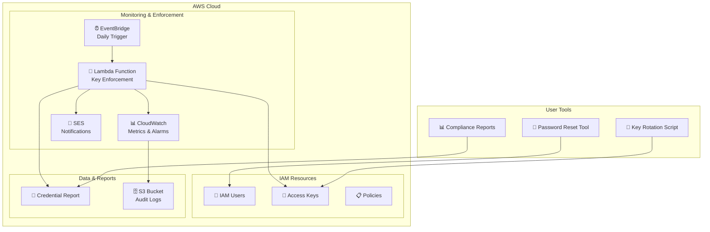

# 🔐 AWS IAM Key Rotation & Security Management

<div align="center">


**Enterprise-grade AWS IAM security tools for automated access key rotation, password management, and compliance monitoring**

[Features](#-features) • [Quick Start](#-quick-start) • [Architecture](#-architecture) • [Documentation](#-documentation) • [Contributing](#-contributing)

</div>

---

## 🌟 Features

### 🔄 **Automated Key Rotation Enforcement**
- **90-day compliance policy** with automated monitoring
- **Lambda-powered enforcement** with daily compliance checks
- **Smart notifications** at 75, 85, and 90+ day thresholds
- **Automatic key disabling** for expired credentials (configurable)
- **User exemption system** via AWS tags

### 🛡️ **Self-Service Security Tools**
- **Interactive key rotation** with guided workflows
- **Secure password reset** with policy validation
- **Rich console interfaces** with color-coded status indicators
- **Comprehensive error handling** and audit logging
- **Backup and rollback** capabilities

### 📊 **Compliance & Monitoring**
- **Real-time compliance reports** with export capabilities
- **CloudWatch metrics and alarms** for proactive monitoring
- **Detailed audit trails** for security compliance
- **Executive dashboards** with compliance statistics
- **Multi-format exports** (JSON, CSV, HTML)

### 🏗️ **Infrastructure as Code**
- **Terraform modules** for complete deployment
- **Least-privilege IAM policies** for security
- **Environment-specific configurations** for dev/staging/prod
- **Automated testing pipeline** with GitHub Actions

---

## 🚀 Quick Start

### Prerequisites

- **AWS CLI** configured with appropriate credentials
- **Python 3.9+** with pip
- **Terraform 1.5+** (for infrastructure deployment)
- **IAM permissions** for user management and Lambda deployment

### 📦 Installation

```bash
# Clone the repository
git clone <repository-url>
cd iam-key-rotation

# Create and activate virtual environment
python3 -m venv venv
source venv/bin/activate

# Install dependencies
cd scripts
pip install -r requirements.txt
```

### ⚡ Quick Commands

```bash
# List access keys with ages and compliance status
python3 scripts/aws_iam_self_service_key_rotation.py -l

# Generate compliance report
python3 scripts/aws_iam_compliance_report.py

# Reset your password securely
python3 scripts/aws_iam_self_service_password_reset.py

# Deploy enforcement infrastructure
cd terraform/iam
terraform init && terraform apply
```

---

## 🏛️ Architecture

<div align="center">



</div>

### 🔧 Core Components

| Component | Purpose | Technology |
|-----------|---------|------------|
| **Lambda Enforcement** | Automated key monitoring and enforcement | Python 3.11, Boto3 |
| **Self-Service Scripts** | User-friendly key and password management | Python, Rich UI |
| **Compliance Engine** | Real-time compliance monitoring and reporting | Python, AWS APIs |
| **Infrastructure** | Automated deployment and configuration | Terraform, CloudFormation |
| **Monitoring** | Metrics, alarms, and observability | CloudWatch, SNS |

---

## 📚 Documentation

### 🔄 Self-Service Key Rotation

Rotate your AWS access keys safely with guided workflows:

```bash
# View current keys with age indicators
python3 scripts/aws_iam_self_service_key_rotation.py -l
```

**🎨 Rich Console Output:**
```
                    AWS Access Keys                     
┏━━━━━━━━━━━━━━━━━━━━━┳━━━━━━━━━━┳━━━━━━━━━━━━━━━━━━━━━┳━━━━━━━━━━━━┓
┃ Key ID              ┃ Status   ┃ Created             ┃ Age (days) ┃
┡━━━━━━━━━━━━━━━━━━━━━╇━━━━━━━━━━╇━━━━━━━━━━━━━━━━━━━━━╇━━━━━━━━━━━━┩
│ AKIAEXAMPLE123456   │ Active   │ 2024-01-15 09:30:00 │ 🔴 95      │
│ AKIAEXAMPLE789012   │ Inactive │ 2024-06-20 14:15:00 │ 🟢 5       │
└─────────────────────┴──────────┴─────────────────────┴────────────┘

⚠️  Key AKIAEXAMPLE123456 is 95 days old and should be rotated immediately!
```

**🔧 Advanced Usage:**
```bash
# Create new key with automatic backup
python3 scripts/aws_iam_self_service_key_rotation.py -c --backup

# Export key information as JSON
python3 scripts/aws_iam_self_service_key_rotation.py -l --json

# Update key status
python3 scripts/aws_iam_self_service_key_rotation.py -u AKIAEXAMPLE inactive
```

### 🔑 Secure Password Reset

Reset your IAM password with enhanced security:

```bash
python3 scripts/aws_iam_self_service_password_reset.py
```

**✨ Features:**
- 🔒 Secure password input (hidden from terminal)
- 🎯 AWS password policy validation
- 🎲 Cryptographically secure password generation
- 📝 Comprehensive audit logging
- 🛡️ Error handling for all AWS scenarios

### 📊 Compliance Reporting

Generate comprehensive compliance reports:

```bash
# Interactive compliance dashboard
python3 scripts/aws_iam_compliance_report.py

# Export to CSV for analysis
python3 scripts/aws_iam_compliance_report.py --csv compliance_report.csv

# JSON export for automation
python3 scripts/aws_iam_compliance_report.py --json compliance_data.json

# Summary only for quick checks
python3 scripts/aws_iam_compliance_report.py --summary-only
```

**📈 Sample Report:**
```
                    Compliance Overview                     
┏━━━━━━━━━━━━━━━━━━━━━━━━━━━━┳━━━━━━━┳━━━━━━━━━━━━┓
┃ Metric                     ┃ Count ┃ Percentage ┃
┡━━━━━━━━━━━━━━━━━━━━━━━━━━━━╇━━━━━━━╇━━━━━━━━━━━━┩
│ Total Users                │ 150   │ 100%       │
│ Users with Access Keys     │ 120   │ 80.0%      │
│ Users with MFA             │ 145   │ 96.7%      │
│ Compliant Users            │ 135   │ 90.0%      │
│ Users with Expired Keys    │ 5     │ 3.3%       │
└────────────────────────────┴───────┴────────────┘
```

### 🚀 Infrastructure Deployment

Deploy the complete enforcement infrastructure:

```bash
cd terraform/iam

# Configure variables (optional)
cp terraform.tfvars.example terraform.tfvars
# Edit terraform.tfvars with your settings

# Deploy infrastructure
terraform init
terraform plan
terraform apply
```

**🎛️ Configuration Options:**
```hcl
# terraform.tfvars
warning_threshold  = 75    # Days before warning
urgent_threshold   = 85    # Days before urgent notice
disable_threshold  = 90    # Days before auto-disable
auto_disable      = true   # Enable automatic disabling
sender_email      = "security@yourcompany.com"
```

---

## ⚙️ Configuration

### 📄 Policy Configuration

Edit `config/settings.yaml` to customize policies:

```yaml
# Access Key Rotation Policy
access_key_policy:
  warning_threshold: 75
  urgent_threshold: 85
  disable_threshold: 90
  auto_disable: false
  exemption_tag: "key-rotation-exempt"

# Notification Settings
notifications:
  sender_email: "cloud-admins@yourcompany.com"
  daily_digest: true
  immediate_alerts: true

# Environment Overrides
environments:
  production:
    access_key_policy:
      auto_disable: true
      disable_threshold: 90
```

### 🏷️ User Exemptions

Exempt specific users from key rotation:

```bash
# Tag a user for exemption
aws iam tag-user \
  --user-name service-account-user \
  --tags Key=key-rotation-exempt,Value=true
```

---

## 🧪 Testing

### 🔍 Run Test Suite

```bash
# Run comprehensive test suite
python tests/run_tests.py

# Run with coverage analysis
coverage run tests/run_tests.py
coverage report
coverage html  # Generate HTML report
```

### 🛡️ Security Testing

```bash
# Run security scans
bandit -r scripts/ lambda/

# Check for hardcoded secrets
python tests/run_tests.py  # Includes security checks
```

### 🏗️ CI/CD Pipeline

The project includes a complete GitHub Actions workflow:
- ✅ Multi-Python version testing (3.9, 3.11, 3.12)
- 🔍 Security scanning with Bandit
- 📝 Terraform validation and linting
- 🧪 Unit and integration testing
- 📦 Lambda package validation

---

## 📈 Monitoring & Observability

### 📊 CloudWatch Metrics

The Lambda function publishes metrics to the `IAM/KeyRotation` namespace:

| Metric | Description |
|--------|-------------|
| `total_keys` | Total number of active access keys |
| `warning_keys` | Keys approaching expiration (75+ days) |
| `urgent_keys` | Keys requiring immediate attention (85+ days) |
| `expired_keys` | Keys past expiration threshold (90+ days) |
| `disabled_keys` | Keys automatically disabled |

### 🚨 Alerting

Configure CloudWatch alarms for proactive monitoring:

```bash
# High-priority alert for expired keys
aws cloudwatch put-metric-alarm \
  --alarm-name "IAM-Expired-Keys-Critical" \
  --alarm-description "Alert when any access keys are expired" \
  --metric-name expired_keys \
  --namespace IAM/KeyRotation \
  --statistic Maximum \
  --period 86400 \
  --threshold 0 \
  --comparison-operator GreaterThanThreshold
```

---

## 🔧 Troubleshooting

### Common Issues

<details>
<summary><strong>🔴 "NoCredentialsError" when running scripts</strong></summary>

**Solution:**
```bash
# Configure AWS credentials
aws configure

# Or set environment variables
export AWS_ACCESS_KEY_ID="your-key-id"
export AWS_SECRET_ACCESS_KEY="your-secret-key"
export AWS_DEFAULT_REGION="us-east-1"
```
</details>

<details>
<summary><strong>🟡 "PasswordPolicyViolation" during password reset</strong></summary>

**Solution:**
The generated password doesn't meet your AWS password policy. Check your account's password policy:
```bash
aws iam get-account-password-policy
```
</details>

<details>
<summary><strong>🔵 Lambda function timeout errors</strong></summary>

**Solution:**
Increase the Lambda timeout in `terraform/iam/lambda.tf`:
```hcl
resource "aws_lambda_function" "access_key_enforcement" {
  timeout = 600  # Increase from 300 to 600 seconds
  # ...
}
```
</details>

### 📝 Debug Mode

Enable debug logging:
```bash
export LOG_LEVEL=DEBUG
python3 scripts/aws_iam_compliance_report.py
```

---

## 🤝 Contributing

We welcome contributions! Please see our [Contributing Guidelines](CONTRIBUTING.md) for details.

### 🚀 Development Setup

```bash
# Fork and clone the repository
git clone https://github.com/yourusername/iam-key-rotation.git

# Create development branch
git checkout -b feature/amazing-feature

# Set up development environment
python3 -m venv venv
source venv/bin/activate
pip install -r scripts/requirements.txt

# Run tests before submitting
python tests/run_tests.py
```

### 📋 Pull Request Process

1. 🔍 Ensure tests pass and security scans are clean
2. 📚 Update documentation for any new features
3. 🏷️ Add appropriate labels to your PR
4. 👥 Request review from maintainers

---

## 📜 License

This project is licensed under the MIT License - see the [LICENSE](LICENSE) file for details.

---

## 🙏 Acknowledgments

- **AWS Security Best Practices** for compliance guidelines
- **Boto3 Community** for excellent AWS SDK support
- **Rich Library** for beautiful console interfaces
- **Terraform Community** for infrastructure as code patterns

---

<div align="center">

**🔐 Secure by Design • 🚀 Enterprise Ready • 🎯 Compliance Focused**

Forked from [AWS IAM Key Rotation](https://github.com/jksprattler/aws-security)
Refactored with ❤️ with Claude and Anthony M.

[⬆️ Back to Top](#-aws-iam-key-rotation--security-management)

</div>