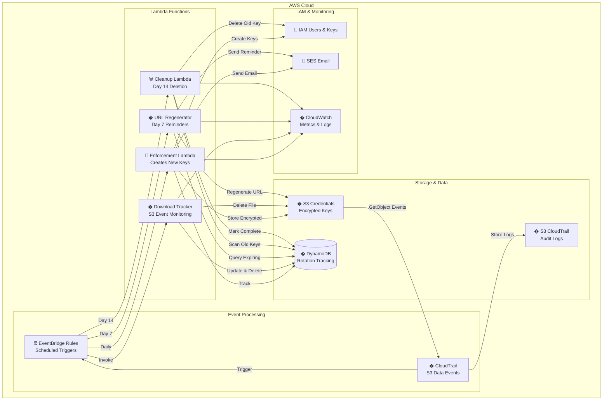

# 🔐 AWS IAM Key Rotation & Security Management

<div align="center">


**Enterprise-grade AWS IAM security tools for automated access key rotation, password management, and compliance monitoring**

[Features](#-features) • [Quick Start](#-quick-start) • [Architecture](#-architecture) • [Documentation](#-documentation) • [Contributing](#-contributing)

</div>

---

## 🌟 Features

### 🔄 **Fully Automated Key Rotation System**
- **Automated key creation** with secure S3 storage and encrypted credentials
- **Pre-signed download URLs** with 7-day expiration and one-time use
- **14-day retention workflow** with automatic cleanup
- **Download tracking** via CloudTrail S3 Data Events
- **Smart reminders** at day 7 if credentials not downloaded
- **DynamoDB tracking** for complete rotation lifecycle management
- **User exemption system** via AWS tags

### 🛡️ **Self-Service Security Tools**
- **Interactive key rotation** with guided workflows
- **Secure password reset** with policy validation
- **Rich console interfaces** with color-coded status indicators
- **Comprehensive error handling** and audit logging
- **Backup and rollback** capabilities

### 📊 **Compliance & Monitoring**
- **Real-time compliance reports** with export capabilities
- **CloudWatch metrics and alarms** for proactive monitoring
- **Detailed audit trails** for security compliance
- **Executive dashboards** with compliance statistics
- **Multi-format exports** (JSON, CSV, HTML)

### 🏗️ **Infrastructure as Code**
- **Terraform modules** for complete deployment
- **Least-privilege IAM policies** for security
- **Environment-specific configurations** for dev/staging/prod
- **Automated testing pipeline** with GitHub Actions

---

## 🚀 Quick Start

### Prerequisites

- **AWS CLI** configured with appropriate credentials
- **Python 3.9+** with pip
- **Terraform 1.5+** (for infrastructure deployment)
- **IAM permissions** for user management and Lambda deployment

### 📦 Installation

```bash
# Clone the repository
git clone <repository-url>
cd iam-key-rotation

# Create and activate virtual environment
python3 -m venv venv
source venv/bin/activate

# Install dependencies
cd scripts
pip install -r requirements.txt
```

### ⚡ Quick Commands

```bash
# List access keys with ages and compliance status
python3 scripts/aws_iam_self_service_key_rotation.py -l

# Generate compliance report
python3 scripts/aws_iam_compliance_report.py

# Reset your password securely
python3 scripts/aws_iam_self_service_password_reset.py

# Deploy enforcement infrastructure
cd terraform/iam
terraform init && terraform apply
```

---

## 🏛️ Architecture

<div align="center">


```mermaid
graph TB
    subgraph "AWS Cloud"
        subgraph "Lambda Functions"
            Enforcement[🔧 Enforcement Lambda<br/>Creates New Keys]
            DownloadTracker[� Download Tracker<br/>S3 Event Monitoring]
            URLRegenerator[� URL Regenerator<br/>Day 7 Reminders]
            Cleanup[🗑️ Cleanup Lambda<br/>Day 14 Deletion]
        end
        
        subgraph "Storage & Data"
            S3Creds[�️ S3 Credentials<br/>Encrypted Keys]
            S3Trail[�️ S3 CloudTrail<br/>Audit Logs]
            DynamoDB[(� DynamoDB<br/>Rotation Tracking)]
        end
        
        subgraph "Event Processing"
            EventBridge[⏰ EventBridge Rules<br/>Scheduled Triggers]
            CloudTrail[� CloudTrail<br/>S3 Data Events]
        end
        
        subgraph "IAM & Monitoring"
            IAM[👥 IAM Users & Keys]
            SES[📧 SES Email]
            CW[� CloudWatch<br/>Metrics & Logs]
        end
    end
    
    EventBridge -->|Daily| Enforcement
    EventBridge -->|Day 7| URLRegenerator
    EventBridge -->|Day 14| Cleanup
    
    Enforcement -->|Create Keys| IAM
    Enforcement -->|Store Encrypted| S3Creds
    Enforcement -->|Track| DynamoDB
    Enforcement -->|Send Email| SES
    
    S3Creds -->|GetObject Events| CloudTrail
    CloudTrail -->|Trigger| EventBridge
    EventBridge -->|Invoke| DownloadTracker
    DownloadTracker -->|Update & Delete| DynamoDB
    DownloadTracker -->|Delete File| S3Creds
    
    URLRegenerator -->|Query Expiring| DynamoDB
    URLRegenerator -->|Regenerate URL| S3Creds
    URLRegenerator -->|Send Reminder| SES
    
    Cleanup -->|Scan Old Keys| DynamoDB
    Cleanup -->|Delete Old Key| IAM
    Cleanup -->|Mark Complete| DynamoDB
    
    CloudTrail -->|Store Logs| S3Trail
    Enforcement --> CW
    DownloadTracker --> CW
    URLRegenerator --> CW
    Cleanup --> CW
```

</div>

### 🔧 Core Components

| Component | Purpose | Technology |
|-----------|---------|------------|
| **Enforcement Lambda** | Creates new keys, stores in S3, initiates rotation | Python 3.11, Boto3 |
| **Download Tracker Lambda** | Monitors S3 downloads, deletes files, updates DynamoDB | Python 3.11, CloudTrail Events |
| **URL Regenerator Lambda** | Sends day 7 reminders with renewed download URLs | Python 3.11, DynamoDB Queries |
| **Cleanup Lambda** | Deletes old keys after 14 days, marks complete | Python 3.11, DynamoDB Scans |
| **S3 Credentials Storage** | Encrypted credential files with pre-signed URLs | S3, AES-256 Encryption |
| **DynamoDB Tracking** | Complete rotation lifecycle and download status | DynamoDB, GSI Indexes |
| **CloudTrail Monitoring** | S3 Data Events for download detection | CloudTrail, EventBridge |
| **Self-Service Scripts** | Legacy manual key and password management tools | Python, Rich UI |

---

## 📚 Documentation

### ⚡ Automated Rotation Workflow

**The system automatically handles the complete key rotation lifecycle:**

#### **Day 0: Key Rotation Initiated**
1. Enforcement Lambda detects old key (≥ threshold)
2. Creates new IAM access key
3. Encrypts and stores credentials in S3
4. Generates 7-day pre-signed download URL
5. Creates DynamoDB tracking record
6. Sends email with download link

#### **Day 1-7: Download Window**
- User clicks download link
- CloudTrail captures S3 GetObject event
- Download Tracker Lambda triggered
- Marks `downloaded: true` in DynamoDB
- Deletes S3 credentials file immediately

#### **Day 7: Reminder (if not downloaded)**
- URL Regenerator Lambda queries DynamoDB
- Checks if credentials file still exists in S3
- Generates new 7-day pre-signed URL
- Sends reminder email with renewed link

#### **Day 14: Cleanup**
- Cleanup Lambda scans for old keys
- Deletes original (old) IAM access key
- Updates DynamoDB status to `completed`
- Marks `old_key_deleted: true`

**📊 Complete tracking in DynamoDB with composite keys and GSI indexes for efficient queries.**

---

### 🔄 Legacy Self-Service Key Rotation

**Note:** These scripts provide manual key rotation. The automated system above is now the primary method.

Rotate your AWS access keys manually with guided workflows:

```bash
# View current keys with age indicators
python3 scripts/aws_iam_self_service_key_rotation.py -l
```

**🎨 Rich Console Output:**
```
                    AWS Access Keys                     
┏━━━━━━━━━━━━━━━━━━━━━┳━━━━━━━━━━┳━━━━━━━━━━━━━━━━━━━━━┳━━━━━━━━━━━━┓
┃ Key ID              ┃ Status   ┃ Created             ┃ Age (days) ┃
┡━━━━━━━━━━━━━━━━━━━━━╇━━━━━━━━━━╇━━━━━━━━━━━━━━━━━━━━━╇━━━━━━━━━━━━┩
│ AKIAEXAMPLE123456   │ Active   │ 2024-01-15 09:30:00 │ 🔴 95      │
│ AKIAEXAMPLE789012   │ Inactive │ 2024-06-20 14:15:00 │ 🟢 5       │
└─────────────────────┴──────────┴─────────────────────┴────────────┘

⚠️  Key AKIAEXAMPLE123456 is 95 days old and should be rotated immediately!
```

**🔧 Advanced Usage:**
```bash
# Create new key with automatic backup
python3 scripts/aws_iam_self_service_key_rotation.py -c --backup

# Export key information as JSON
python3 scripts/aws_iam_self_service_key_rotation.py -l --json

# Update key status
python3 scripts/aws_iam_self_service_key_rotation.py -u AKIAEXAMPLE inactive
```

### 🔑 Secure Password Reset

Reset your IAM password with enhanced security:

```bash
python3 scripts/aws_iam_self_service_password_reset.py
```

**✨ Features:**
- 🔒 Secure password input (hidden from terminal)
- 🎯 AWS password policy validation
- 🎲 Cryptographically secure password generation
- 📝 Comprehensive audit logging
- 🛡️ Error handling for all AWS scenarios

### 📊 Compliance Reporting

Generate comprehensive compliance reports:

```bash
# Interactive compliance dashboard
python3 scripts/aws_iam_compliance_report.py

# Export to CSV for analysis
python3 scripts/aws_iam_compliance_report.py --csv compliance_report.csv

# JSON export for automation
python3 scripts/aws_iam_compliance_report.py --json compliance_data.json

# Summary only for quick checks
python3 scripts/aws_iam_compliance_report.py --summary-only
```

**📈 Sample Report:**
```
                    Compliance Overview                     
┏━━━━━━━━━━━━━━━━━━━━━━━━━━━━┳━━━━━━━┳━━━━━━━━━━━━┓
┃ Metric                     ┃ Count ┃ Percentage ┃
┡━━━━━━━━━━━━━━━━━━━━━━━━━━━━╇━━━━━━━╇━━━━━━━━━━━━┩
│ Total Users                │ 150   │ 100%       │
│ Users with Access Keys     │ 120   │ 80.0%      │
│ Users with MFA             │ 145   │ 96.7%      │
│ Compliant Users            │ 135   │ 90.0%      │
│ Users with Expired Keys    │ 5     │ 3.3%       │
└────────────────────────────┴───────┴────────────┘
```

### 🚀 Infrastructure Deployment

Deploy the complete automated rotation infrastructure using Terragrunt:

```bash
# Navigate to your environment
cd terragrunt/mvw-dw-nonprod/us-east-1/dev/iam-key-rotation

# Review configuration
cat config.hcl

# Deploy all infrastructure (4 Lambdas, S3, DynamoDB, CloudTrail, EventBridge)
terragrunt init
terragrunt plan
terragrunt apply

# Test the system
aws lambda invoke \
  --function-name iam-access-key-enforcement \
  --profile dw-nonprod \
  --region us-east-1 \
  /tmp/test-output.json

# Run workflow tests
python3 tests/test_rotation_workflow.py
```

**🎛️ Configuration Options:**
```hcl
# config.hcl
locals {
  # Key Rotation Thresholds (days)
  warning_threshold    = 75    # Trigger rotation at 75 days
  urgent_threshold     = 85    # Urgent notice at 85 days
  disable_threshold    = 90    # Delete old key after rotation
  auto_disable         = false # Manual deletion (safer for testing)
  
  # Email Configuration
  sender_email         = "security@yourcompany.com"
  
  # System Settings
  schedule_expression  = "rate(1 day)"    # Daily enforcement checks
  exemption_tag        = "key-rotation-exempt"
  
  # Test Users (for dev/testing only)
  user_info = {
    "test-user-1" = {
      email = "your-email@company.com"
      user_tags = { "purpose" = "testing" }
    }
  }
}
```

**📦 Deployed Infrastructure:**
- 4 Lambda functions (enforcement, download_tracker, url_regenerator, cleanup)
- 2 S3 buckets (credentials storage, CloudTrail logs)
- 1 DynamoDB table with GSI indexes
- CloudTrail S3 Data Events trail
- 3 EventBridge rules (daily, day-7, day-14)
- CloudWatch log groups and alarms
- IAM roles with least-privilege policies

---

## ⚙️ Configuration

### 📄 Policy Configuration

Edit `config/settings.yaml` to customize policies:

```yaml
# Access Key Rotation Policy
access_key_policy:
  warning_threshold: 75
  urgent_threshold: 85
  disable_threshold: 90
  auto_disable: false
  exemption_tag: "key-rotation-exempt"

# Notification Settings
notifications:
  sender_email: "cloud-admins@yourcompany.com"
  daily_digest: true
  immediate_alerts: true

# Environment Overrides
environments:
  production:
    access_key_policy:
      auto_disable: true
      disable_threshold: 90
```

### 🏷️ User Exemptions

Exempt specific users from key rotation:

```bash
# Tag a user for exemption
aws iam tag-user \
  --user-name service-account-user \
  --tags Key=key-rotation-exempt,Value=true
```

---

## 🧪 Testing

### 🔍 Run Test Suite

```bash
# Run comprehensive test suite
pytest

# Run with coverage analysis
coverage run -m pytest
coverage report
coverage html  # Generate HTML report
```

### 🛡️ Security Testing

```bash
# Run security scans
bandit -r scripts/ lambda/

# Check for hardcoded secrets
pytest -m integration --collect-only  # Lists integration tests without executing them or their fixtures
```

### 🏗️ CI/CD Pipeline

The project includes a complete GitHub Actions workflow:
- ✅ Multi-Python version testing (3.9, 3.11, 3.12)
- 🔍 Security scanning with Bandit
- 📝 Terraform validation and linting
- 🧪 Unit and integration testing
- 📦 Lambda package validation

---

## 📈 Monitoring & Observability

### 📊 CloudWatch Metrics

The enforcement Lambda publishes metrics to the `IAM/KeyRotation` namespace:

| Metric | Description |
|--------|-------------|
| `total_keys` | Total number of active access keys processed |
| `warning_keys` | Keys triggering rotation (≥ warning threshold) |
| `urgent_keys` | Keys at urgent threshold |
| `expired_keys` | Keys at disable threshold (rotation initiated) |
| `disabled_keys` | Reserved for future auto-disable feature |

**Additional Tracking:**
- Download status tracked in DynamoDB (`downloaded: true/false`)
- Rotation lifecycle status: `rotation_initiated`, `completed`
- CloudWatch logs for all 4 Lambda functions
- CloudTrail S3 Data Events for download monitoring

### 🚨 Alerting

Configure CloudWatch alarms for proactive monitoring:

```bash
# High-priority alert for expired keys
aws cloudwatch put-metric-alarm \
  --alarm-name "IAM-Expired-Keys-Critical" \
  --alarm-description "Alert when any access keys are expired" \
  --metric-name expired_keys \
  --namespace IAM/KeyRotation \
  --statistic Maximum \
  --period 86400 \
  --threshold 0 \
  --comparison-operator GreaterThanThreshold
```

---

## 🔧 Troubleshooting

### Common Issues

<details>
<summary><strong>🔴 "NoCredentialsError" when running scripts</strong></summary>

**Solution:**
```bash
# Configure AWS credentials
aws configure

# Or set environment variables
export AWS_ACCESS_KEY_ID="your-key-id"
export AWS_SECRET_ACCESS_KEY="your-secret-key"
export AWS_DEFAULT_REGION="us-east-1"
```
</details>

<details>
<summary><strong>🟡 "PasswordPolicyViolation" during password reset</strong></summary>

**Solution:**
The generated password doesn't meet your AWS password policy. Check your account's password policy:
```bash
aws iam get-account-password-policy
```
</details>

<details>
<summary><strong>🔵 Lambda function timeout errors</strong></summary>

**Solution:**
Increase the Lambda timeout in `terraform/iam/lambda.tf`:
```hcl
resource "aws_lambda_function" "access_key_enforcement" {
  timeout = 600  # Increase from 300 to 600 seconds
  # ...
}
```
</details>

### 📝 Debug Mode

Enable debug logging:
```bash
export LOG_LEVEL=DEBUG
python3 scripts/aws_iam_compliance_report.py
```

---

## 🤝 Contributing

We welcome contributions! Please see our [Contributing Guidelines](CONTRIBUTING.md) for details.

### 🚀 Development Setup

```bash
# Fork and clone the repository
git clone https://github.com/yourusername/iam-key-rotation.git

# Create development branch
git checkout -b feature/amazing-feature

# Set up development environment
python3 -m venv venv
source venv/bin/activate
pip install -r scripts/requirements.txt

# Run tests before submitting
pytest
```

### 📋 Pull Request Process

1. 🔍 Ensure tests pass and security scans are clean
2. 📚 Update documentation for any new features
3. 🏷️ Add appropriate labels to your PR
4. 👥 Request review from maintainers

---

## 📜 License

This project is licensed under the MIT License - see the [LICENSE](LICENSE) file for details.

---

## 🙏 Acknowledgments

- **AWS Security Best Practices** for compliance guidelines
- **Boto3 Community** for excellent AWS SDK support
- **Rich Library** for beautiful console interfaces
- **Terraform Community** for infrastructure as code patterns

---

<div align="center">

**🔐 Secure by Design • 🚀 Enterprise Ready • 🎯 Compliance Focused**

Forked from [AWS IAM Key Rotation](https://github.com/jksprattler/aws-security)
Refactored with ❤️ with Claude and Anthony M.

[⬆️ Back to Top](#-aws-iam-key-rotation--security-management)

</div>