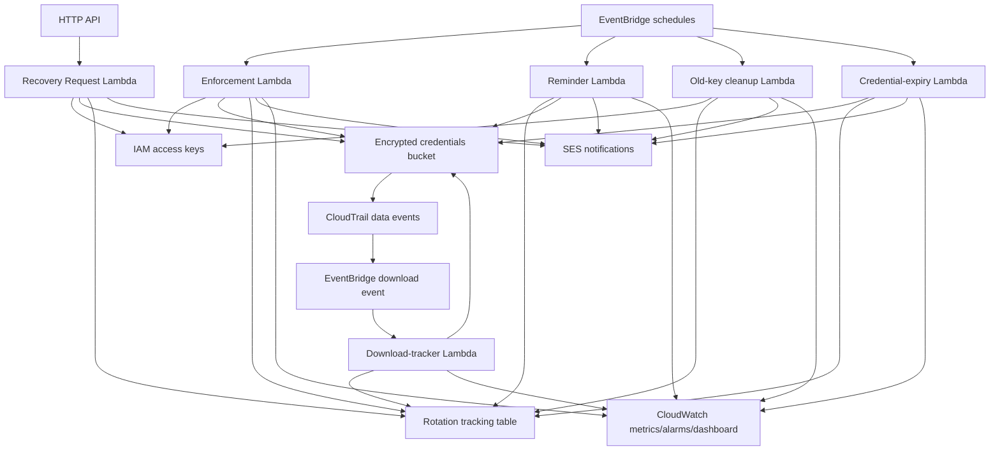

# IAM Key Rotation

Enterprise AWS IAM access-key rotation with Terragrunt-managed infrastructure, Lambda-driven lifecycle enforcement, and explicit operational controls.

## What Ships

- Automated access-key rotation for IAM users tagged with `email`.
- Anonymous self-service recovery for undownloaded rotated credentials through `POST /access-key-recovery/request`.
- One canonical lifecycle backed by DynamoDB and S3:
  - Day 0: create new key, store encrypted credentials in S3, email a 7-day pre-signed URL.
  - Any time before expiry: the user can request a fresh SES delivery link if the rotated credential is still pending download and the S3 object still exists.
  - Day 7/14/21/...: reminder Lambda reissues a fresh URL if credentials are still pending download.
  - Day 23: warning that the old key will be deleted in 7 days.
  - Day 30: old key is deleted. If the new credentials are still pending, the user receives an urgent notice.
  - Day 45: remaining credential objects are deleted and the rotation expires.
- Exact download correlation by `s3_key` through DynamoDB, not “latest record for user”.
- Irrecoverable one-time download semantics in the primary path:
  - active pre-signed URLs are never stored in DynamoDB
  - the credentials bucket does not keep recoverable object versions
- CloudWatch alarms, Lambda async failure DLQ, and an operations dashboard.
- CI enforcement for `black`, `flake8`, `mypy`, `bandit`, `pytest`, `terraform validate`, `tflint`, `checkov`, and `terraform plan`.

## Architecture


```mermaid
graph TD
    API["HTTP API"] --> REC["Recovery Request Lambda"]
    EB["EventBridge schedules"] --> ENF["Enforcement Lambda"]
    EB --> REM["Reminder Lambda"]
    EB --> CLN["Old-key cleanup Lambda"]
    EB --> EXP["Credential-expiry Lambda"]

    REC --> IAM
    REC --> S3
    REC --> DDB
    REC --> SES

    ENF --> IAM["IAM access keys"]
    ENF --> S3["Encrypted credentials bucket"]
    ENF --> DDB["Rotation tracking table"]
    ENF --> SES["SES notifications"]

    S3 --> CT["CloudTrail data events"]
    CT --> EVT["EventBridge download event"]
    EVT --> DLT["Download-tracker Lambda"]
    DLT --> DDB
    DLT --> S3

    REM --> DDB
    REM --> S3
    REM --> SES

    CLN --> IAM
    CLN --> DDB
    CLN --> SES

    EXP --> S3
    EXP --> DDB
    EXP --> SES

    ENF --> CW["CloudWatch metrics/alarms/dashboard"]
    REM --> CW
    CLN --> CW
    EXP --> CW
    DLT --> CW
```

## Deployment Entry Point

Environment deploys are Terragrunt-only. The Terraform module under [`terraform/iam`](/Users/nizda/Dev/cc/iam-key-rotation/terraform/iam/README.md) is the implementation unit, not the documented operator entrypoint.

Use the environment layout under [`terragrunt`](/Users/nizda/Dev/cc/iam-key-rotation/terragrunt/README.md):

```bash
cp terragrunt/mvw-dw-nonprod/account.hcl.example terragrunt/mvw-dw-nonprod/account.hcl
cp terragrunt/mvw-dw-nonprod/us-east-1/dev/iam-key-rotation/config.hcl.example \
  terragrunt/mvw-dw-nonprod/us-east-1/dev/iam-key-rotation/config.hcl

cd terragrunt/mvw-dw-nonprod/us-east-1/dev/iam-key-rotation
terragrunt init
terragrunt plan
terragrunt apply
```

Every deploy requires explicit environment configuration:

- `name_prefix` and `environment_name` are part of the Terraform contract.
- `account_id` and `aws_region` are part of the Terraform contract.
- `sender_email` must be set.
- `support_email` should be set for recovery guidance, or it will default to `sender_email`.
- `alarm_sns_topic` must be set.
- recovery request rate limits can be overridden per environment.
- managed IAM users, if any, must be declared explicitly via `managed_user_info`.
- the module no longer creates default IAM users or Terraform-managed access keys.

## Validation

Local validation uses the same gates enforced in CI:

```bash
python3 -m venv venv
source venv/bin/activate
pip install -r scripts/requirements.txt -r tests/requirements.txt

black --check .
flake8 scripts/ lambda/ tests/ --max-line-length=120 --ignore=E501,W503,E203
mypy scripts/ lambda/
bandit -r scripts/ lambda/
pytest

terraform -chdir=terraform/iam fmt -check -recursive
terraform -chdir=terraform/iam init -backend=false -input=false
terraform -chdir=terraform/iam validate
tflint --chdir=terraform/iam
checkov -d terraform/iam
terraform -chdir=terraform/iam plan -input=false -lock=false
```

## Documentation

- Deployment: [`DEPLOYMENT.md`](/Users/nizda/Dev/cc/iam-key-rotation/DEPLOYMENT.md)
- Terragrunt layout: [`terragrunt/README.md`](/Users/nizda/Dev/cc/iam-key-rotation/terragrunt/README.md)
- Terraform module contract: [`terraform/iam/README.md`](/Users/nizda/Dev/cc/iam-key-rotation/terraform/iam/README.md)
- Operations runbook: [`docs/OPERATIONS_RUNBOOK.md`](/Users/nizda/Dev/cc/iam-key-rotation/docs/OPERATIONS_RUNBOOK.md)
- Production readiness review: [`docs/PRODUCTION_READINESS_REVIEW.md`](/Users/nizda/Dev/cc/iam-key-rotation/docs/PRODUCTION_READINESS_REVIEW.md)
