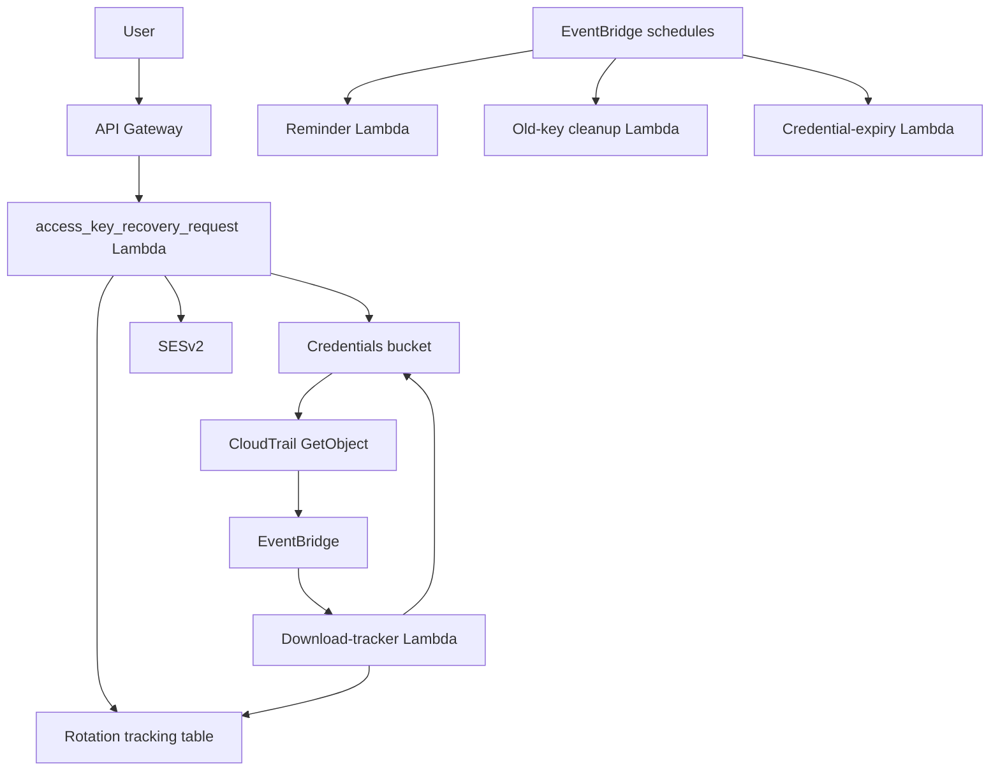

# IAM Access Key Recovery And Reissue Implementation Plan

This document is the execution plan for the clarified requirement: recovering or reissuing rotated IAM access-key material, not AWS console passwords.

The repository already delivers rotated access keys through SES and one-time S3 links. The missing capability is an explicit recovery and reissue path that works within the current lifecycle and does not weaken the one-time-secret guarantees.

## Goal

Add a first-class recovery path for rotated IAM access keys and secret keys:

1. A user requests recovery for pending rotated credentials.
2. The system validates that an eligible undownloaded rotation exists.
3. The system sends a fresh SES notification with a new pre-signed S3 download URL for the existing credential object.
4. The first successful download still deletes the S3 object and marks the rotation as completed.
5. If the credential object is already deleted, already downloaded, or expired, the request is rejected generically and routed to manual recovery guidance without breaking irrecoverability guarantees.

## Scope Correction

If “password” means the rotated IAM secret access key:

- Do not build IAM login-profile reset flows.
- Do not use `CreateLoginProfile`, `UpdateLoginProfile`, or `ChangePassword`.
- Do not create a second recovery-only secret store.
- Do not email plaintext credentials.

The system should stay anchored to the existing canonical access-key rotation lifecycle in:

- [/Users/nizda/Dev/cc/iam-key-rotation/lambda/access_key_enforcement/access_key_enforcement.py](/Users/nizda/Dev/cc/iam-key-rotation/lambda/access_key_enforcement/access_key_enforcement.py)
- [/Users/nizda/Dev/cc/iam-key-rotation/lambda/download_tracker/download_tracker.py](/Users/nizda/Dev/cc/iam-key-rotation/lambda/download_tracker/download_tracker.py)
- [/Users/nizda/Dev/cc/iam-key-rotation/lambda/url_regenerator/url_regenerator.py](/Users/nizda/Dev/cc/iam-key-rotation/lambda/url_regenerator/url_regenerator.py)
- [/Users/nizda/Dev/cc/iam-key-rotation/lambda/cleanup/cleanup.py](/Users/nizda/Dev/cc/iam-key-rotation/lambda/cleanup/cleanup.py)
- [/Users/nizda/Dev/cc/iam-key-rotation/lambda/s3_cleanup/s3_cleanup.py](/Users/nizda/Dev/cc/iam-key-rotation/lambda/s3_cleanup/s3_cleanup.py)

## Non-Negotiable Design Rules

- Preserve the current one-time-download model.
- Never recreate or reveal a secret that was already downloaded and deleted.
- Never store active pre-signed URLs in DynamoDB.
- Never email plaintext access-key material.
- Never generate a new access key from the anonymous recovery path.
- Always return a generic success response from unauthenticated request APIs.
- Only reissue access when the existing S3 credential object is still present and the rotation status is recovery-eligible.
- Keep all business rules in the existing rotation status model or a small extension of it.

## Current System Reality

Today the system already does most of the lifecycle work:

- Day 0:
  - create new key
  - store JSON credential blob in S3
  - write DynamoDB rotation record
  - send SES email with pre-signed URL
- Day 7/14/21/...:
  - scheduled reminder Lambda reissues a fresh pre-signed URL
- First successful download:
  - CloudTrail + EventBridge trigger download tracker
  - S3 object is deleted
  - DynamoDB record is marked downloaded
- Day 30:
  - old key is deleted
  - if credentials are still pending, urgent email may include another pre-signed URL
- Day 45:
  - remaining undownloaded credential objects are deleted
  - record becomes expired

The gap is not SES delivery. The gap is an explicit on-demand user recovery trigger before expiry.

## Recommended Product Shape

Build a lightweight recovery request API for undownloaded rotated credentials.

### What it should do

- Accept `username` or `email`.
- Look up the most recent eligible rotation record for that user.
- If the record is in:
  - `pending_download`
  - `old_key_deleted_pending_download`
  and the S3 object still exists:
  - generate a fresh pre-signed URL
  - send an SES email immediately
  - update reminder/audit metadata in DynamoDB
- Otherwise:
  - return a generic `202`
  - optionally send a manual-support email only if that is operationally acceptable

### What it should not do

- Create a new IAM access key.
- Reconstruct a deleted secret.
- Bypass the existing cleanup/download tracker path.
- Fork a second canonical storage model for rotated secrets.

## Canonical Architecture



## Canonical Data Model

Do not create a separate recovery table by default.

Reuse the existing rotation record in DynamoDB and add only the minimum missing fields if needed.

### Existing statuses to keep

- `pending_download`
- `downloaded`
- `old_key_deleted_pending_download`
- `completed`
- `expired_no_download`

### Optional fields to add

- `last_self_service_reissue_at`
- `self_service_reissue_count`
- `last_reissue_request_ip`

These should be added only if current `email_sent_count` and `last_reminder_day` are not enough for auditability.

## Eligibility Rules

A recovery request is eligible only when all of the following are true:

- The IAM user exists.
- The user has exactly one registered `email` tag matching the target identity.
- There is an active rotation record in:
  - `pending_download`
  - `old_key_deleted_pending_download`
- The S3 object referenced by `s3_key` still exists.
- The request is within configured cooldown and daily rate limits.

A recovery request is ineligible when any of these are true:

- The latest rotation status is `downloaded`, `completed`, or `expired_no_download`.
- The S3 object no longer exists.
- Multiple IAM users share the same recovery email tag.
- No `email` tag exists.

## Shared Code Reuse

The Phase 1 helper work that already landed is still useful and should remain:

- [/Users/nizda/Dev/cc/iam-key-rotation/lambda/common/email.py](/Users/nizda/Dev/cc/iam-key-rotation/lambda/common/email.py)
- [/Users/nizda/Dev/cc/iam-key-rotation/lambda/common/password_recovery_common.py](/Users/nizda/Dev/cc/iam-key-rotation/lambda/common/password_recovery_common.py)

However, the password-generation helper is not on the critical path for this clarified feature:

- [/Users/nizda/Dev/cc/iam-key-rotation/lambda/common/iam_passwords.py](/Users/nizda/Dev/cc/iam-key-rotation/lambda/common/iam_passwords.py)

## Adjusted Implementation Phases

## Phase 1: Shared Email And Recovery Request Primitives

Status: mostly complete.

Keep:

- shared SES helper
- shared recovery config/status helpers

Repurpose:

- `/Users/nizda/Dev/cc/iam-key-rotation/lambda/password_recovery_request/password_recovery_request.py`

Rename in implementation when convenient:

- `password_recovery_request` -> `access_key_recovery_request`

### Required config

- `SENDER_EMAIL`
- `SUPPORT_EMAIL`
- `SES_REGION`
- `SES_CONFIGURATION_SET`
- `DYNAMODB_TABLE`
- `S3_BUCKET`
- `ACCESS_KEY_RECOVERY_REQUEST_COOLDOWN_MINUTES`
- `ACCESS_KEY_RECOVERY_MAX_REQUESTS_PER_DAY`

### Acceptance criteria

- All SES sends go through the shared helper.
- Recovery request config validates up front.

## Phase 2: On-Demand Access-Key Recovery Request API

Repurpose the current request Lambda into an access-key reissue endpoint.

### New canonical file target

- `/Users/nizda/Dev/cc/iam-key-rotation/lambda/access_key_recovery_request/access_key_recovery_request.py`

If you want to minimize churn, the current file can be adapted first and renamed later.

### Input contract

```json
{
  "username": "alice"
}
```

or

```json
{
  "email": "alice@example.com"
}
```

### Behavior

- Accept exactly one of `username` or `email`.
- Normalize and validate input.
- Resolve the user by exact `username` or unique `email` tag.
- Query the latest eligible rotation record from the existing tracking table.
- Verify:
  - status is recovery-eligible
  - S3 object exists
  - request is not rate-limited
- Generate a fresh pre-signed URL against the existing `s3_key`.
- Send an SES email using the same general messaging style as the reminder flow.
- Return generic `202` regardless of outcome.

### DynamoDB updates

- increment `email_sent_count`
- optionally record:
  - `last_self_service_reissue_at`
  - `last_reissue_request_ip`
  - `self_service_reissue_count`

### Acceptance criteria

- Eligible undownloaded credentials can be reissued on demand.
- Downloaded or expired credentials are not resurrected.
- The endpoint does not leak whether a user exists.

## Phase 3: Shared Reissue Helper

Extract the common “fresh URL + SES notification” logic currently duplicated in:

- [/Users/nizda/Dev/cc/iam-key-rotation/lambda/url_regenerator/url_regenerator.py](/Users/nizda/Dev/cc/iam-key-rotation/lambda/url_regenerator/url_regenerator.py)
- [/Users/nizda/Dev/cc/iam-key-rotation/lambda/cleanup/cleanup.py](/Users/nizda/Dev/cc/iam-key-rotation/lambda/cleanup/cleanup.py)

### New file

- `/Users/nizda/Dev/cc/iam-key-rotation/lambda/common/reissue.py`

### Responsibilities

- verify object exists
- generate pre-signed URL
- render correct email template
- send email
- apply idempotent tracking updates

### Acceptance criteria

- Scheduled reminder flow and on-demand recovery flow share one canonical implementation.

## Phase 4: Terraform And API Gateway

### New files

- `/Users/nizda/Dev/cc/iam-key-rotation/terraform/iam/access_key_recovery_api.tf`
- `/Users/nizda/Dev/cc/iam-key-rotation/terraform/iam/access_key_recovery_lambda.tf`

### Existing files to modify

- `/Users/nizda/Dev/cc/iam-key-rotation/terraform/iam/variables.tf`
- `/Users/nizda/Dev/cc/iam-key-rotation/terraform/iam/outputs.tf`
- `/Users/nizda/Dev/cc/iam-key-rotation/terraform/iam/locals.tf`
- `/Users/nizda/Dev/cc/iam-key-rotation/terraform/iam/README.md`

### Resources to add

- API Gateway route:
  - `POST /access-key-recovery/request`
- Lambda function and log group
- IAM role/policy for:
  - `iam:GetUser`
  - `iam:ListUsers`
  - `iam:ListUserTags`
  - `dynamodb:Query`
  - `dynamodb:UpdateItem`
  - `s3:HeadObject`
  - `s3:GetObject`
  - SES send permission
  - KMS decrypt/describe if needed for object checks or URL generation context

### Acceptance criteria

- Recovery request path deploys through Terragrunt.
- No new storage system is introduced unless strictly necessary.

## Phase 5: Templates And User Messaging

### Files to modify

- `/Users/nizda/Dev/cc/iam-key-rotation/lambda/common/notifications.py`
- `/Users/nizda/Dev/cc/iam-key-rotation/docs/email-templates.md`

### Add a dedicated email template for self-service reissue

The email should:

- clearly state this is a reissued link for already-rotated credentials
- include expiry time
- reiterate one-time download semantics
- provide support contact

### Acceptance criteria

- Reissue emails are distinct from scheduled reminders but use the same core semantics.

## Phase 6: Tests

### New tests

- `/Users/nizda/Dev/cc/iam-key-rotation/tests/test_access_key_recovery_request_lambda.py`

### Existing tests to extend

- `/Users/nizda/Dev/cc/iam-key-rotation/tests/test_url_regenerator_lambda.py`
- `/Users/nizda/Dev/cc/iam-key-rotation/tests/test_cleanup_lambdas.py`
- `/Users/nizda/Dev/cc/iam-key-rotation/tests/test_lambda_enforcement.py`

### Coverage requirements

- eligible pending download record reissues successfully
- eligible `old_key_deleted_pending_download` record reissues successfully
- downloaded record does not reissue
- expired record does not reissue
- missing S3 object does not reissue
- duplicate email tag does not reissue
- rate limiting/cooldown works
- generic `202` is returned for unknown users

## Phase 7: Documentation

### Files to modify

- `/Users/nizda/Dev/cc/iam-key-rotation/README.md`
- `/Users/nizda/Dev/cc/iam-key-rotation/DEPLOYMENT.md`
- `/Users/nizda/Dev/cc/iam-key-rotation/docs/OPERATIONS_RUNBOOK.md`
- `/Users/nizda/Dev/cc/iam-key-rotation/terraform/iam/README.md`

### Documentation changes

- describe the new on-demand recovery path for undownloaded rotated credentials
- document its limits:
  - only before expiry
  - only while the object still exists
  - cannot recover already-downloaded or deleted secrets
- document operational fallback for expired or completed rotations

## Suggested Delivery Sequence

1. Keep the shared email helper work.
2. Repurpose the current request Lambda from console-password semantics to access-key reissue semantics.
3. Extract common reissue logic from the reminder path.
4. Add API Gateway and IAM policy.
5. Add tests for access-key recovery eligibility and generic responses.
6. Update docs and runbooks.

## Validation Commands

Run the normal repository gates after implementation:

```bash
python3 -m venv venv
source venv/bin/activate
pip install -r scripts/requirements.txt -r tests/requirements.txt

black .
flake8 scripts/ lambda/ tests/ --max-line-length=120 --ignore=E501,W503,E203
mypy scripts/ lambda/
bandit -r scripts/ lambda/
pytest

terraform -chdir=terraform/iam fmt -check -recursive
terraform -chdir=terraform/iam init -backend=false -input=false
terraform -chdir=terraform/iam validate
tflint --chdir=terraform/iam
checkov -d terraform/iam
terraform -chdir=terraform/iam plan -input=false -lock=false
```

## Recommendation

Treat the already-implemented console-password recovery request work as non-canonical for this repo and do not continue that branch of the feature.

The correct next implementation step is:

- adapt the request Lambda to query the existing rotation table and reissue a fresh pre-signed URL for undownloaded rotated credentials

not:

- continue building login-profile reset flows

## Definition Of Done

- A user can request a fresh delivery link for rotated IAM access-key credentials that are still pending download.
- The system sends that reissued link through SES.
- The one-time download model is preserved.
- Downloaded or expired secrets are not resurrected.
- Docs, tests, Terraform, and runbooks reflect the shipped recovery behavior.
