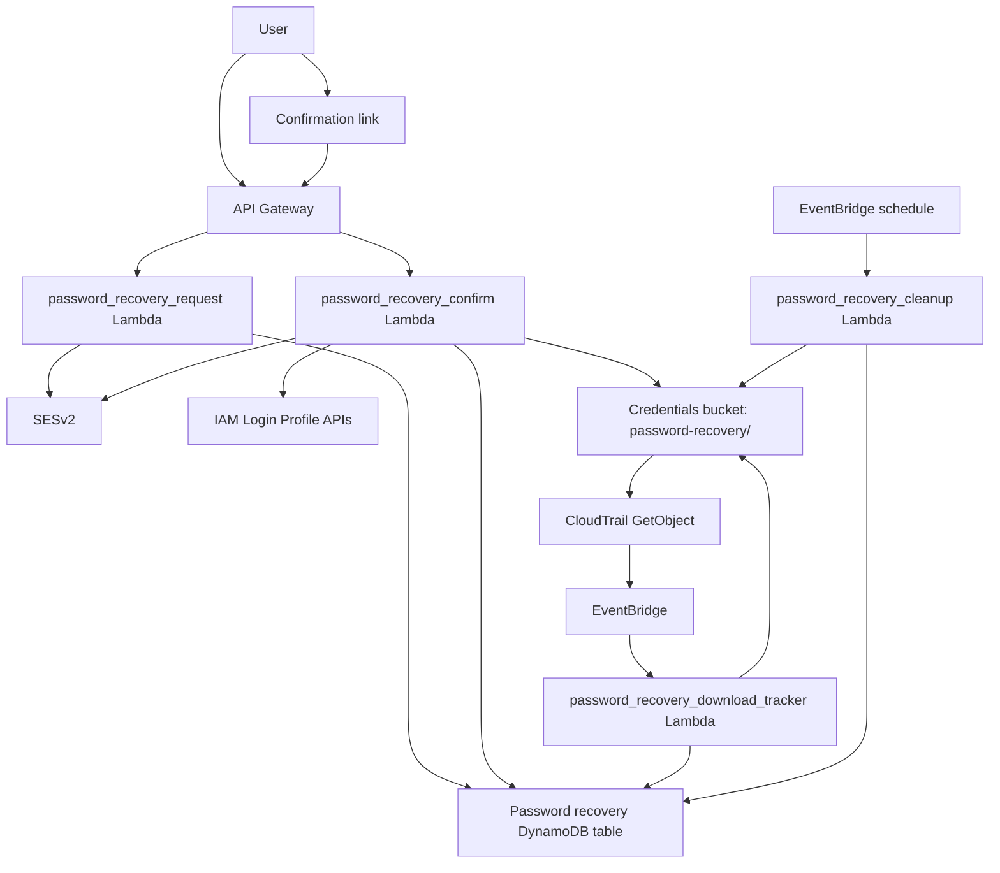

# IAM Console Password Recovery Implementation Plan

Superseded for this repository's current scope.

The active plan for the user's clarified requirement is:

- [/Users/nizda/Dev/cc/iam-key-rotation/docs/ACCESS_KEY_RECOVERY_IMPLEMENTATION_PLAN.md](/Users/nizda/Dev/cc/iam-key-rotation/docs/ACCESS_KEY_RECOVERY_IMPLEMENTATION_PLAN.md)

This document remains only as historical context for a console-password recovery design that is not the current target because AWS console access is federated through SSO in the intended environment.

## Goal

Add a secure self-service recovery path for forgotten or expired IAM console passwords:

1. User requests password recovery with `username` or `email`.
2. System sends a confirmation email to the IAM user's registered email tag.
3. User confirms the request from their inbox.
4. System resets the IAM console login profile with a temporary password and `PasswordResetRequired=true`.
5. System delivers the temporary password through a one-time S3 download link sent via SES.
6. First successful download deletes the secret object and marks the recovery complete.

## Non-Negotiable Design Rules

- Do not email plaintext passwords directly.
- Do not reset a password on the initial anonymous request.
- Always require email inbox confirmation before resetting the login profile.
- Always return a generic success response from the request endpoint to prevent user enumeration.
- Store only hashed confirmation tokens in DynamoDB.
- Keep recovery objects irrecoverable after deletion.
- Allow at most one active recovery per user.
- Apply cooldowns and per-day rate limits.
- Use SES as the only mail transport in the primary implementation path.

## AWS Primitive Constraints

- Self-service password change for a signed-in IAM user uses `ChangePassword` and requires the old password.
- Forgotten-password recovery must be implemented with admin-side `CreateLoginProfile` or `UpdateLoginProfile`.
- Temporary passwords must comply with the account password policy.

## Canonical Architecture



## Canonical Data Model

Use a dedicated table for password recovery. Do not overload the access-key rotation table.

### Table

- Resource: `aws_dynamodb_table.password_recovery_tracking`
- Primary key:
  - `PK = USER#<username>`
  - `SK = RECOVERY#<recovery_id>`
- TTL attribute: `TTL`

### Attributes

- `PK`
- `SK`
- `recovery_id`
- `username`
- `email`
- `requested_at`
- `confirmed_at`
- `confirmation_expires_at`
- `confirmation_token_hash`
- `request_source_ip`
- `confirm_source_ip`
- `status`
- `s3_key`
- `downloaded`
- `download_timestamp`
- `download_ip`
- `s3_file_deleted`
- `s3_file_deletion_timestamp`
- `password_expires_at`
- `email_sent_count`
- `last_email_sent_at`
- `superseded_by`
- `failure_reason`
- `TTL`

### Statuses

Define these in a new shared module and treat them as the only valid lifecycle states:

- `confirmation_pending`
- `reset_issued`
- `downloaded`
- `expired`
- `superseded`
- `failed`

### GSIs

- `status-index`
  - hash: `status`
  - range: `requested_at`
- `confirmation-token-index`
  - hash: `confirmation_token_hash`
- `s3-key-index`
  - hash: `s3_key`

## S3 Object Shape

Store temporary passwords in the existing credentials bucket under a dedicated prefix:

- `password-recovery/<username>/<recovery_id>.json`

Object body:

```json
{
  "Username": "alice",
  "TemporaryPassword": "generated-temporary-password",
  "IssuedAt": "2026-03-15T12:00:00Z",
  "PasswordResetRequired": true
}
```

Apply the same security stance already used for access-key rotation:

- SSE-KMS
- no recoverable version history
- CloudTrail read event tracking
- deletion immediately after first successful download event

## Shared Code Changes

## Phase 1: Shared Primitives

### New files

- `/Users/nizda/Dev/cc/iam-key-rotation/lambda/common/email.py`
- `/Users/nizda/Dev/cc/iam-key-rotation/lambda/common/iam_passwords.py`
- `/Users/nizda/Dev/cc/iam-key-rotation/lambda/common/password_recovery_common.py`

### Responsibilities

`email.py`

- Create a shared SESv2 client.
- Provide a single `send_html_email(...)` helper.
- Support:
  - sender email
  - support email
  - optional configuration set
  - reply-to
  - subject
  - html body
  - plain-text fallback

`iam_passwords.py`

- Move password generation and policy validation out of the current scripts.
- Implement:
  - `generate_temporary_password(iam_client, min_length: int | None = None) -> str`
  - `validate_password_policy(iam_client, password: str) -> list[str]`
- Remove duplicated password generation logic from:
  - `/Users/nizda/Dev/cc/iam-key-rotation/scripts/aws_iam_self_service_password_reset.py`
  - `/Users/nizda/Dev/cc/iam-key-rotation/scripts/aws_iam_user_password_reset.py`

`password_recovery_common.py`

- Define statuses.
- Define key builders.
- Define token hashing helper.
- Define TTL helpers.
- Define request/confirm/download expiry calculations.
- Define config loading and validation for:
  - `SENDER_EMAIL`
  - `SUPPORT_EMAIL`
  - `PASSWORD_RECOVERY_TABLE`
  - `S3_BUCKET`
  - `RECOVERY_CONFIRM_TTL_MINUTES`
  - `RECOVERY_DOWNLOAD_TTL_HOURS`
  - `RECOVERY_REQUEST_COOLDOWN_MINUTES`
  - `RECOVERY_MAX_REQUESTS_PER_DAY`
  - `SES_CONFIGURATION_SET`
  - `PASSWORD_RECOVERY_BASE_URL`

### Existing files to modify

- `/Users/nizda/Dev/cc/iam-key-rotation/lambda/password_notification/password_notification.py`
- `/Users/nizda/Dev/cc/iam-key-rotation/scripts/aws_iam_self_service_password_reset.py`
- `/Users/nizda/Dev/cc/iam-key-rotation/scripts/aws_iam_user_password_reset.py`

### Acceptance criteria

- No Lambda sends email through bespoke inline SES code.
- No password generation logic remains duplicated.
- Runtime config fails fast on missing required recovery env vars.

## Phase 2: Recovery Request API

### New files

- `/Users/nizda/Dev/cc/iam-key-rotation/lambda/password_recovery_request/password_recovery_request.py`

### Responsibilities

Handle an anonymous recovery initiation request.

Input contract:

```json
{
  "username": "alice"
}
```

or

```json
{
  "email": "alice@example.com"
}
```

Behavior:

- Accept exactly one of `username` or `email`.
- Normalize and validate input.
- Resolve the target IAM user:
  - `username` path: `GetUser`
  - `email` path: scan/list IAM users carefully, then match on exact `email` tag
- Require a unique registered email tag.
- Enforce cooldown and daily request limits.
- Supersede any older `confirmation_pending` requests for that user.
- Generate a random confirmation token.
- Store only the token hash in DynamoDB.
- Email a confirmation link through SES to the registered email address.
- Return generic HTTP `202` regardless of whether the user was found.

Response contract:

```json
{
  "message": "If the account is eligible, a recovery email will be sent."
}
```

### Notes

- Do not reveal whether the username exists.
- Do not reveal whether an email matched an IAM user.
- Do not reset the password here.

### Acceptance criteria

- Repeated requests inside cooldown do not spam email.
- Unknown users receive the same API response as valid users.
- A valid request creates exactly one active `confirmation_pending` record.

## Phase 3: Recovery Confirm API

### New files

- `/Users/nizda/Dev/cc/iam-key-rotation/lambda/password_recovery_confirm/password_recovery_confirm.py`

### Responsibilities

Consume the confirmation token and issue the recovery secret.

Input contract:

- `GET /password-recovery/confirm?token=<opaque-token>`
  or
- `POST` with token payload if API Gateway/UI constraints require it

Behavior:

- Hash the token and look up the matching record through `confirmation-token-index`.
- Fail if token is missing, invalid, expired, superseded, or already used.
- Generate a temporary password using shared helpers.
- Determine whether to call:
  - `UpdateLoginProfile` if the login profile exists
  - `CreateLoginProfile` if it does not exist
- Always set `PasswordResetRequired=True`.
- Write the temporary password into the S3 recovery object.
- Update the DynamoDB record to `reset_issued`.
- Send a retrieval email containing the one-time pre-signed S3 URL.
- Return a simple success page or JSON payload with no secret material.

### Acceptance criteria

- Confirmation is single use.
- The login profile is updated or created exactly once.
- The temporary password never appears in API responses or logs.

## Phase 4: Download Tracking

### New files

- `/Users/nizda/Dev/cc/iam-key-rotation/lambda/password_recovery_download_tracker/password_recovery_download_tracker.py`

### Responsibilities

- Receive CloudTrail-backed `GetObject` events for `password-recovery/*`.
- Ignore non-recovery objects.
- Delete the S3 object immediately.
- Update the matching DynamoDB record via `s3-key-index`.
- Mark:
  - `downloaded=true`
  - `download_timestamp`
  - `download_ip`
  - `s3_file_deleted=true`
  - `status=downloaded`

### Acceptance criteria

- First successful download removes the object.
- Retries are idempotent.
- Non-recovery objects are ignored safely.

## Phase 5: Cleanup

### New files

- `/Users/nizda/Dev/cc/iam-key-rotation/lambda/password_recovery_cleanup/password_recovery_cleanup.py`

### Responsibilities

- Run on a schedule.
- Query `reset_issued` recoveries.
- If the recovery object is older than `RECOVERY_DOWNLOAD_TTL_HOURS`:
  - delete the object if still present
  - mark the record `expired`
- Query `confirmation_pending` recoveries.
- If the confirmation window has expired:
  - mark the record `expired`

### Acceptance criteria

- Undownloaded temp passwords do not persist past TTL.
- Expired confirmations cannot be redeemed.

## Phase 6: Password Notification Integration

### Existing file to modify

- `/Users/nizda/Dev/cc/iam-key-rotation/lambda/password_notification/password_notification.py`

### Change

Turn the current password expiry notice into the supported entry point for recovery.

New email content should:

- distinguish between:
  - signed-in users who can still change their own password
  - users who need recovery
- direct users to the new password recovery request URL
- remove the “reply to this email and we’ll assist” manual-primary guidance

Also fix current implementation issues:

- remove hardcoded sender address
- use shared email helper
- use validated env config

### Acceptance criteria

- Password notification emails point to the recovery flow.
- Sender identity is not hardcoded in code.

## Phase 7: Terraform

### New files

- `/Users/nizda/Dev/cc/iam-key-rotation/terraform/iam/password_recovery_dynamodb.tf`
- `/Users/nizda/Dev/cc/iam-key-rotation/terraform/iam/password_recovery_lambda.tf`
- `/Users/nizda/Dev/cc/iam-key-rotation/terraform/iam/password_recovery_api.tf`

### Existing files to modify

- `/Users/nizda/Dev/cc/iam-key-rotation/terraform/iam/s3.tf`
- `/Users/nizda/Dev/cc/iam-key-rotation/terraform/iam/variables.tf`
- `/Users/nizda/Dev/cc/iam-key-rotation/terraform/iam/outputs.tf`
- `/Users/nizda/Dev/cc/iam-key-rotation/terraform/iam/locals.tf`
- `/Users/nizda/Dev/cc/iam-key-rotation/terraform/iam/README.md`

### Resources to add

`password_recovery_dynamodb.tf`

- `aws_dynamodb_table.password_recovery_tracking`
- CloudWatch alarm for table user errors or throttles

`password_recovery_lambda.tf`

- IAM roles and policies for:
  - request Lambda
  - confirm Lambda
  - download tracker Lambda
  - cleanup Lambda
- Lambda functions
- log groups
- EventBridge schedule for cleanup
- Lambda permissions

`password_recovery_api.tf`

- HTTP API or REST API
- routes:
  - `POST /password-recovery/request`
  - `GET /password-recovery/confirm`
- stage
- permissions for API Gateway to invoke Lambdas

### IAM permissions needed

Request Lambda:

- `iam:GetUser`
- `iam:ListUsers`
- `iam:ListUserTags`
- `dynamodb:PutItem`
- `dynamodb:UpdateItem`
- `dynamodb:Query`
- `ses:SendEmail` or SESv2 equivalent

Confirm Lambda:

- `iam:GetUser`
- `iam:GetLoginProfile`
- `iam:CreateLoginProfile`
- `iam:UpdateLoginProfile`
- `iam:GetAccountPasswordPolicy`
- `s3:PutObject`
- `s3:GetObject`
- `dynamodb:GetItem`
- `dynamodb:UpdateItem`
- `dynamodb:Query`
- `ses:SendEmail` or SESv2 equivalent
- KMS usage for bucket encryption

Download tracker Lambda:

- `s3:DeleteObject`
- `dynamodb:Query`
- `dynamodb:UpdateItem`

Cleanup Lambda:

- `s3:DeleteObject`
- `s3:HeadObject`
- `dynamodb:Query`
- `dynamodb:UpdateItem`

### S3/Event changes

Update the CloudTrail/EventBridge pattern in `/Users/nizda/Dev/cc/iam-key-rotation/terraform/iam/s3.tf` so the download tracker also captures:

- `password-recovery/*`

### Variables to add

- `password_recovery_enabled`
- `password_recovery_base_url`
- `password_recovery_confirm_ttl_minutes`
- `password_recovery_download_ttl_hours`
- `password_recovery_request_cooldown_minutes`
- `password_recovery_max_requests_per_day`
- `ses_configuration_set`

### Acceptance criteria

- Recovery infrastructure deploys through Terragrunt using the same environment model as the rest of the module.
- API routes, Lambdas, table, and alarms appear in Terraform plan output.

## Phase 8: Tests

### New test files

- `/Users/nizda/Dev/cc/iam-key-rotation/tests/test_password_recovery_request_lambda.py`
- `/Users/nizda/Dev/cc/iam-key-rotation/tests/test_password_recovery_confirm_lambda.py`
- `/Users/nizda/Dev/cc/iam-key-rotation/tests/test_password_recovery_download_tracker_lambda.py`
- `/Users/nizda/Dev/cc/iam-key-rotation/tests/test_password_recovery_cleanup_lambda.py`
- `/Users/nizda/Dev/cc/iam-key-rotation/tests/test_email_common.py`
- `/Users/nizda/Dev/cc/iam-key-rotation/tests/test_iam_passwords.py`
- `/Users/nizda/Dev/cc/iam-key-rotation/tests/integration/test_password_recovery_flow.py`

### Existing tests to update

- `/Users/nizda/Dev/cc/iam-key-rotation/tests/test_password_notification_lambda.py`
- `/Users/nizda/Dev/cc/iam-key-rotation/tests/test_password_reset.py`
- `/Users/nizda/Dev/cc/iam-key-rotation/tests/test_admin_password_reset.py`

### Coverage requirements

Request Lambda:

- valid username request
- valid email request
- unknown username returns generic success
- duplicate request during cooldown
- multiple users sharing the same email tag is rejected internally
- users without email tag are ignored safely

Confirm Lambda:

- valid token with existing login profile
- valid token with no login profile
- expired token
- reused token
- password policy retrieval failure
- password policy violation retry

Download tracker:

- first download marks record and deletes object
- repeated event is idempotent

Cleanup:

- expires stale confirmation requests
- expires undownloaded recovery objects

Integration:

- request -> confirm -> profile reset -> S3 object -> first download -> object deleted -> state updated

## Phase 9: Documentation

### Files to modify

- `/Users/nizda/Dev/cc/iam-key-rotation/README.md`
- `/Users/nizda/Dev/cc/iam-key-rotation/DEPLOYMENT.md`
- `/Users/nizda/Dev/cc/iam-key-rotation/docs/OPERATIONS_RUNBOOK.md`
- `/Users/nizda/Dev/cc/iam-key-rotation/docs/email-templates.md`
- `/Users/nizda/Dev/cc/iam-key-rotation/terraform/iam/README.md`

### Documentation changes

- document the new recovery API
- document required env vars and Terragrunt config
- document the user-facing recovery steps
- document manual recovery fallbacks
- document security assumptions and rate limiting

## Suggested Delivery Sequence

Execute in this order to keep the diff coherent and reviewable:

1. Shared email and password helper extraction.
2. Password recovery common module and data model.
3. Terraform table and env var scaffolding.
4. Request Lambda plus tests.
5. Confirm Lambda plus tests.
6. Download tracker plus S3 event wiring.
7. Cleanup Lambda plus tests.
8. Password notification integration.
9. Docs and rollout notes.
10. Full validation suite.

## Validation Commands

Run the full repository gates after implementation:

```bash
python3 -m venv venv
source venv/bin/activate
pip install -r scripts/requirements.txt -r tests/requirements.txt

black .
flake8 scripts/ lambda/ tests/ --max-line-length=120 --ignore=E501,W503,E203
mypy scripts/ lambda/
bandit -r scripts/ lambda/
pytest

terraform -chdir=terraform/iam fmt -check -recursive
terraform -chdir=terraform/iam init -backend=false -input=false
terraform -chdir=terraform/iam validate
tflint --chdir=terraform/iam
checkov -d terraform/iam
terraform -chdir=terraform/iam plan -input=false -lock=false
```

## Open Decisions To Resolve Before Coding

- Whether to use SES v1 `send_email` or standardize now on SESv2.
- Whether the confirm endpoint returns JSON only or an HTML success page.
- Whether the existing credentials bucket should be reused or a dedicated recovery bucket should be created.
- Whether reminder/reissue emails are needed for password recovery, or whether a single issuance plus cleanup is sufficient.
- Whether recovery by `email` should be supported if IAM users are not guaranteed to have unique email tags.

## Recommendation

Default to:

- SESv2
- HTML success page for the confirmation route
- reuse the existing credentials bucket with a dedicated `password-recovery/` prefix
- no reminder/reissue Lambda in v1
- support `email` lookup only if uniqueness is enforced; otherwise accept `username` only

## Definition Of Done

- A forgotten IAM console password can be recovered without administrator intervention.
- Recovery email delivery uses SES.
- Temporary passwords are never delivered inline in email or API responses.
- Temporary passwords are retrievable exactly once.
- Recovery state is auditable and expires automatically.
- Docs, Terraform, tests, and runbooks reflect shipped behavior.
