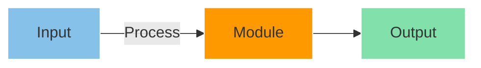

# 🔧 [Module Name] Module

<div align="center">

[](https://www.terraform.io/)
[](https://aws.amazon.com/)

</div>

## Overview 🎯
[Brief description of what this module does and its purpose]

## Features ✨
- Feature 1
- Feature 2
- Feature 3

## Architecture 🏗️


## Usage 📋
```hcl
module "example" {
  source = "./modules/[module-name]"

  # Required variables
  name        = "example"
  environment = "dev"

  # Optional variables
  tags = {
    Environment = "dev"
    Project     = "example"
  }
}
```

## Requirements 📌

| Name | Version |
|------|---------|
| terraform | >= 1.0.0 |
| aws | >= 4.0.0 |

## Providers 🏢

| Name | Version |
|------|---------|
| aws | >= 4.0.0 |

## Resources 🔨

| Name | Type |
|------|------|
| [resource_name](resource_link) | resource |

## Inputs 📥

| Name | Description | Type | Default | Required |
|------|-------------|------|---------|:--------:|
| name | Resource name | `string` | n/a | yes |
| environment | Environment name | `string` | n/a | yes |
| tags | Resource tags | `map(string)` | `{}` | no |

## Outputs 📤

| Name | Description |
|------|-------------|
| id | Resource ID |
| arn | Resource ARN |

## Example 💡
```hcl
module "example" {
  source = "./modules/[module-name]"

  name        = "example"
  environment = "dev"
  
  tags = {
    Environment = "dev"
    Project     = "example"
    ManagedBy   = "terraform"
  }
}
```

## Best Practices 🎯
- Best practice 1
- Best practice 2
- Best practice 3

## Security Considerations 🔒
- Security consideration 1
- Security consideration 2
- Security consideration 3

## Troubleshooting 🔍
Common issues and their solutions:

1. **Issue 1**
   - Solution 1
   - Solution 2

2. **Issue 2**
   - Solution 1
   - Solution 2

## Related Modules 🔗
- [Related Module 1](link)
- [Related Module 2](link)

---

<div align="center">

**[ [Back to Top](#-module-name-module) ]**

</div>
