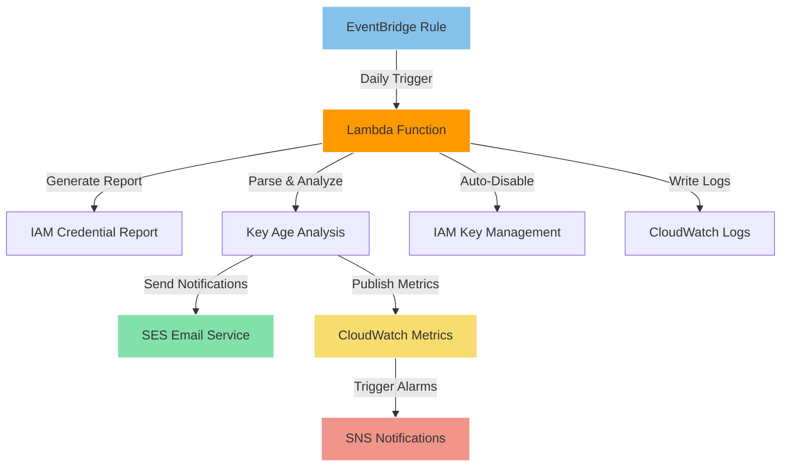

# 🔧 IAM Key Rotation Enforcement Module

<div align="center">

[](https://www.terraform.io/)
[](https://aws.amazon.com/)

</div>

## Overview 🎯
This Terraform module deploys an automated IAM access key rotation enforcement system using AWS Lambda, EventBridge, and CloudWatch. It provides enterprise-grade monitoring, compliance reporting, and automated notifications for aging IAM access keys.

## Features ✨
- **Automated Key Monitoring**: Daily scans of all IAM access keys in the account
- **Multi-Threshold Alerts**: Warning, urgent, and disable notifications at configurable thresholds
- **Email Notifications**: SES-powered email alerts with actionable instructions
- **CloudWatch Integration**: Metrics publishing and configurable alarms
- **User Exemption System**: Tag-based exemption for service accounts and special users
- **Auto-Disable Capability**: Optional automatic disabling of expired access keys
- **Test User Management**: Optional creation of test IAM users for validation
- **Comprehensive Logging**: Detailed CloudWatch logs for audit and troubleshooting

## Architecture 🏗️


## Usage 📋
```hcl
module "iam_key_rotation" {
  source = "./terraform/iam"

  # Email Configuration
  sender_email = "security-team@yourcompany.com"

  # Key Age Thresholds (days)
  warning_threshold = 75
  urgent_threshold  = 85
  disable_threshold = 90
  
  # Auto-disable expired keys
  auto_disable = false  # Set to true for strict enforcement

  # Schedule (daily recommended for production)
  schedule_expression = "rate(1 day)"

  # Resource tags
  common_tags = {
    Environment = "prod"
    Project     = "security-compliance"
    ManagedBy   = "terraform"
  }

  # Test users for validation (optional)
  user_info = {
    "test-user-1" = {
      email = "security-team@yourcompany.com"
      user_tags = {
        "purpose" = "iam-key-rotation-testing"
      }
    }
  }
}
```

## Requirements 📌

| Name | Version |
|------|---------|
| terraform | >= 1.5.0 |
| aws | >= 5.16.2 |

## Providers 🏢

| Name | Version |
|------|---------|
| aws | >= 5.16.2 |
| archive | >= 2.0 |

## Resources 🔨

| Name | Type |
|------|------|
| [aws_lambda_function.access_key_enforcement](https://registry.terraform.io/providers/hashicorp/aws/latest/docs/resources/lambda_function) | resource |
| [aws_iam_role.lambda_execution_role](https://registry.terraform.io/providers/hashicorp/aws/latest/docs/resources/iam_role) | resource |
| [aws_iam_policy.lambda_policy](https://registry.terraform.io/providers/hashicorp/aws/latest/docs/resources/iam_policy) | resource |
| [aws_cloudwatch_event_rule.daily_check](https://registry.terraform.io/providers/hashicorp/aws/latest/docs/resources/cloudwatch_event_rule) | resource |
| [aws_cloudwatch_event_target.lambda_target](https://registry.terraform.io/providers/hashicorp/aws/latest/docs/resources/cloudwatch_event_target) | resource |
| [aws_cloudwatch_log_group.lambda_logs](https://registry.terraform.io/providers/hashicorp/aws/latest/docs/resources/cloudwatch_log_group) | resource |
| [aws_cloudwatch_metric_alarm.expired_keys_alarm](https://registry.terraform.io/providers/hashicorp/aws/latest/docs/resources/cloudwatch_metric_alarm) | resource |
| [aws_cloudwatch_metric_alarm.non_compliant_users_alarm](https://registry.terraform.io/providers/hashicorp/aws/latest/docs/resources/cloudwatch_metric_alarm) | resource |
| [aws_iam_user.this](https://registry.terraform.io/providers/hashicorp/aws/latest/docs/resources/iam_user) | resource |
| [aws_iam_access_key.this](https://registry.terraform.io/providers/hashicorp/aws/latest/docs/resources/iam_access_key) | resource |

## Inputs 📥

| Name | Description | Type | Default | Required |
|------|-------------|------|---------|:--------:|
| common_tags | Map of common tags to apply to all resources | `map(any)` | `{}` | no |
| warning_threshold | Number of days before access key expiration to send warning | `number` | `75` | no |
| urgent_threshold | Number of days before access key expiration to send urgent notice | `number` | `85` | no |
| disable_threshold | Number of days after which access keys are disabled | `number` | `90` | no |
| auto_disable | Whether to automatically disable expired access keys | `bool` | `false` | no |
| sender_email | Email address to send notifications from (must be verified in SES) | `string` | `"security-team@yourcompany.com"` | no |
| exemption_tag | Tag key to check for access key rotation exemptions | `string` | `"key-rotation-exempt"` | no |
| schedule_expression | CloudWatch Events schedule expression for Lambda execution | `string` | `"rate(1 day)"` | no |
| alarm_sns_topic | SNS topic ARN for CloudWatch alarms (optional) | `string` | `""` | no |
| user_info | Map of AWS IAM usernames, email address tags and custom user tags | `map(object({email = string, user_tags = optional(map(string))}))` | See variables.tf | no |

## Outputs 📤

| Name | Description |
|------|-------------|
| lambda_function_arn | ARN of the IAM access key enforcement Lambda function |
| lambda_function_name | Name of the IAM access key enforcement Lambda function |
| lambda_log_group | CloudWatch log group for the Lambda function |
| lambda_role_arn | ARN of the Lambda execution role |
| eventbridge_rule_arn | ARN of the EventBridge rule that triggers the Lambda |
| cloudwatch_alarms | Map of CloudWatch alarm ARNs |
| iam_users | Map of created IAM users and their details |
| test_user_access_keys | Access key information for test users (IDs and creation dates) |
| test_user_access_key_secrets | Access key secrets for test users (sensitive output) |
| configuration_summary | Summary of Lambda configuration settings |

## Example 💡
```hcl
# Development environment with safe testing settings
module "iam_key_rotation_dev" {
  source = "./terraform/iam"

  # Safe testing thresholds
  warning_threshold = 30   # 30 days for faster testing
  urgent_threshold  = 45   # 45 days for faster testing  
  disable_threshold = 60   # 60 days for faster testing
  auto_disable      = false # No auto-disable in dev
  
  # More frequent checks for testing
  schedule_expression = "rate(6 hours)"
  
  # Email configuration
  sender_email = "dev-security@yourcompany.com"
  
  # Test users
  user_info = {
    "iam-test-user-1" = {
      email = "dev-security@yourcompany.com"
      user_tags = {
        "purpose"     = "iam-key-rotation-testing"
        "environment" = "dev"
      }
    }
  }
  
  common_tags = {
    Environment = "dev"
    Project     = "iam-key-rotation"
    ManagedBy   = "terraform"
    Purpose     = "security-testing"
  }
}

# Production environment with strict enforcement
module "iam_key_rotation_prod" {
  source = "./terraform/iam"

  # Production thresholds
  warning_threshold = 75
  urgent_threshold  = 85
  disable_threshold = 90
  auto_disable      = true  # Strict enforcement in prod
  
  # Daily execution
  schedule_expression = "rate(1 day)"
  
  # Production email
  sender_email = "security-alerts@yourcompany.com"
  
  # SNS integration for critical alerts
  alarm_sns_topic = "arn:aws:sns:us-east-1:YOUR-ACCOUNT-ID:security-alerts"
  
  common_tags = {
    Environment = "prod"
    Project     = "iam-key-rotation"
    ManagedBy   = "terraform"
    CriticalityLevel = "high"
  }
}
```

## Best Practices 🎯
- **Start with testing**: Deploy in dev environment with `auto_disable = false` first
- **Verify SES setup**: Ensure sender email is verified in SES before deployment
- **Use exemption tags**: Tag service accounts with `key-rotation-exempt = "true"`
- **Monitor CloudWatch logs**: Regularly check Lambda execution logs for issues
- **Test email delivery**: Validate email notifications reach intended recipients
- **Gradual rollout**: Test with individual users before organization-wide deployment
- **Regular key rotation**: Establish organizational policies for regular key rotation

## Security Considerations 🔒
- **Least privilege IAM**: Lambda uses minimal required permissions for IAM and SES operations
- **No hardcoded credentials**: All configuration via environment variables and tags
- **Audit logging**: All actions logged to CloudWatch for security audit trails  
- **Email security**: Uses SES with verified sender addresses to prevent spoofing
- **Tag-based exemptions**: Secure exemption system for critical service accounts
- **Optional auto-disable**: Can be disabled for safety during initial deployment

## Troubleshooting 🔍
Common issues and their solutions:

1. **Lambda function fails with SES permissions error**
   - Verify sender email is verified in SES
   - Check IAM policy includes SES send permissions
   - Ensure SES is available in your deployment region

2. **No email notifications received**
   - Check CloudWatch logs for Lambda execution errors
   - Verify recipient email addresses in user tags
   - Check SES sending limits and bounce rates

3. **Users not found in credential report**
   - Verify IAM users exist and have access keys
   - Check if credential report generation is completing successfully
   - Ensure Lambda has proper IAM permissions

4. **Auto-disable not working**
   - Verify `auto_disable` variable is set to `true`
   - Check Lambda IAM permissions include key deletion rights
   - Review CloudWatch logs for error messages

## Related Modules 🔗
- [IAM User Management Scripts](../../scripts/) - Self-service tools for key rotation
- [IAM Compliance Reporting](../../scripts/aws_iam_compliance_report.py) - Detailed compliance reports
- [Password Reset Tools](../../scripts/aws_iam_user_password_reset.py) - User password management

---

<div align="center">

**[ [Back to Top](#-iam-key-rotation-enforcement-module) ]**

</div>
